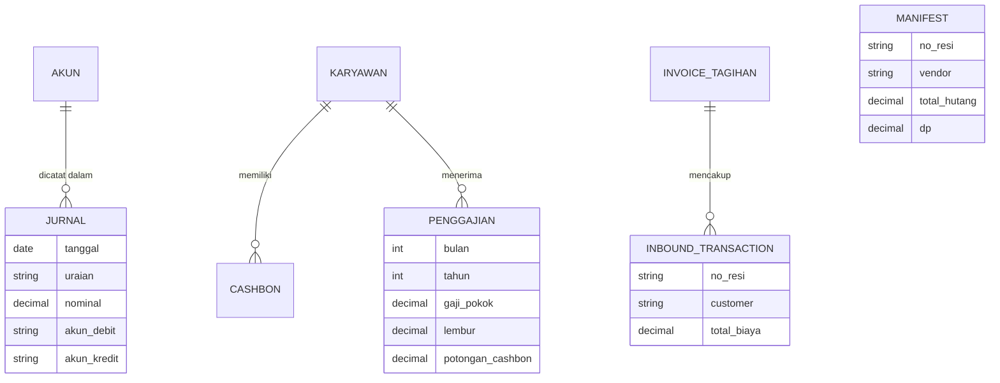
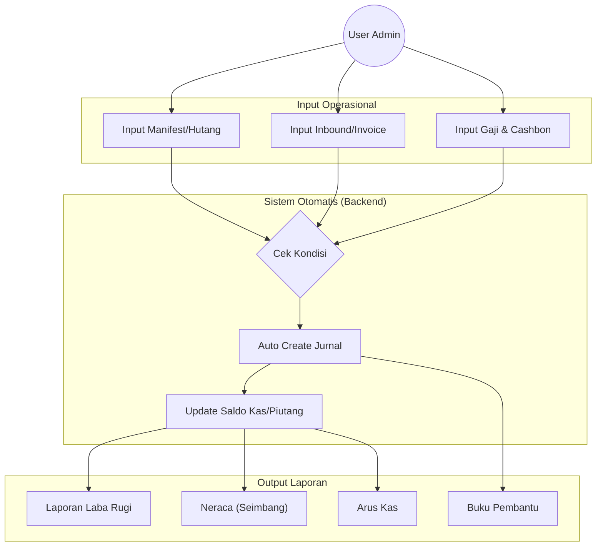

# Dashboard Keuangan & Logistik - BMM Cargo

Aplikasi web berbasis Django untuk manajemen keuangan (Akuntansi) dan operasional logistik (Inbound, Outbound, Manifest Hutang, Penggajian) yang terintegrasi penuh untuk CV Borneo Mega Mandiri.

## 🌐 Deployment

Aplikasi telah di-deploy di PythonAnywhere dan dapat diakses melalui link berikut:
🔗 **[https://bmmcargo.pythonanywhere.com/](https://bmmcargo.pythonanywhere.com/)**

Aplikasi ini menggunakan **Django 5.x/6.x** dan **Bootstrap 5** untuk antarmuka yang responsif dan modern.

---

## 🚀 Fitur Unggulan

### 1. 🤖 Sistem Akuntansi Otomatis (Auto-Journaling)

Sistem ini menghilangkan kebutuhan input jurnal manual untuk transaksi rutin. Jurnal otomatis terbentuk saat transaksi operasional dilakukan:

- **Manifest (Hutang Vendor)**:
  - Saat Manifest dibuat → Otomatis Debit `Biaya Pengiriman Vendor` & Kredit `Hutang Usaha`.
  - Jika ada DP → Otomatis Debit `Biaya Pengiriman Vendor` & Kredit `Kas`.
- **Inbound (Piutang Customer)**:
  - Saat Invoice dibuat → Otomatis Debit `Piutang Usaha` & Kredit `Pendapatan Jasa`.
- **Penggajian (Gaji & Cashbon)**:
  - Saat Slip Gaji disimpan → Otomatis Debit `Biaya Gaji` & Kredit `Kas` + `Piutang Karyawan`.
- **Cashbon**:
  - Saat input cashbon → Otomatis Debit `Piutang Karyawan` & Kredit `Kas`.

### 2. 📊 Laporan Keuangan Real-time

Laporan keuangan dihasilkan secara instan berdasarkan input data operasional:

- **Laba Rugi (Income Statement)**: Filter per periode tahun, menampilkan Pendapatan vs Beban Operasional.
- **Neraca (Balance Sheet)**: Tampilan posisi keuangan (Aset, Kewajiban, Ekuitas) yang **selalu seimbang (balance)** dengan fitur perhitungan _Laba Ditahan_ otomatis.
- **Arus Kas (Cash Flow)**: Metode langsung, melacak aliran uang masuk dan keluar.
- **Neraca Saldo**: Rekapitulasi saldo akhir semua akun.

### 3. 🚚 Manajemen Logistik & Operasional

- **Inbound (Barang Masuk)**:
  - Pencatatan resi masuk, vendor, berat (Kg), dan koli.
  - Pembuatan **Invoice Tagihan** kolektif dari beberapa resi inbound sekaligus.
  - Cetak Invoice PDF siap kirim.
- **Outbound (Barang Keluar)**:
  - Manajemen pengiriman vendor pihak ketiga.
  - Analisis Profit per resi (Selisih harga jual vs biaya vendor).
- **Manifest (Hutang Vendor)**:
  - Dashboard monitoring hutang vendor yang belum lunas.
  - Tampilan daftar manifest dengan filter "Lunas" vs "Belum".
  - Import data otomatis dari Excel/CSV.

### 4. 👥 SDM & Penggajian (Payroll)

- **Database Karyawan**: Data lengkap karyawan, jabatan, dan gaji pokok.
- **Slip Gaji Bulanan**: Form input gaji dengan perhitungan otomatis (Gaji Pokok + Lembur + Bonus - Potongan).
- **Manajemen Cashbon**: Pencatatan pinjaman karyawan dengan fitur pelunasan otomatis potong gaji.

### 5. 📒 Buku Pembantu & Kas Harian

- **Kas Harian**: Buku kas kecil opsional per bulan untuk tracking pengeluaran operasional ringan.
- **Buku Pembantu Piutang**: Rincian tagihan customer yang belum terbayar.
- **Buku Pembantu Hutang**: Rincian kewajiban ke vendor ekspedisi.

---

## 💻 Tech Stack

Aplikasi ini dibangun menggunakan teknologi open-source yang handal dan modern:

### Backend

- **Python 3.10+**: Bahasa pemrograman utama.
- **Django 5.0**: Framework web high-level untuk keamanan dan kecepatan pengembangan.
- **Pandas**: Library untuk pemrosesan data Excel/CSV (Import Manifest).

### Frontend

- **HTML5 & CSS3**: Struktur dan styling dasar.
- **Bootstrap 5**: Framework CSS untuk desain responsif dan komponen UI modern.
- **JavaScript (Vanilla)**: Interaktivitas sisi klien (Modal, Kalkulasi dinamis).
- **Bootstrap Icons**: Ikon vektor ringan.

### Database & Tools

- **SQLite 3**: Database default (Ringan, Portable). Kompatibel dengan PostgreSQL/MySQL untuk production.
- **Git**: Version control system.
- **Whitenoise**: Serving file statis.

---

## 📐 Skema Database (ERD)

Berikut adalah gambaran relasi antar entitas utama dalam sistem:



---

## 🔄 Alur Kerja Sistem (Flowchart)

Diagram alur bagaimana data operasional diproses menjadi laporan keuangan:



---

## 🛠️ Instalasi & Pengembangan Lokal

1. **Clone Repository**

   ```bash
   git clone https://github.com/bmmcargo/dashboard-accountant.git
   cd dashboard-accountant
   ```

2. **Setup Virtual Environment**

   ```bash
   python -m venv .venv
   # Windows
   .venv\Scripts\activate
   # Linux/Mac
   source .venv/bin/activate
   ```

3. **Install Dependencies**

   ```bash
   pip install -r requirements.txt
   ```

4. **Migrasi Database**

   ```bash
   python manage.py migrate
   ```

5. **Kunci Akun Awal (Seeding)**
   _(Optional: Untuk mengisi Chart of Accounts standar)_

   ```bash
   python manage.py seed_accounts
   ```

6. **Buat Superuser (Admin)**

   ```bash
   python manage.py createsuperuser
   ```

7. **Jalankan Server**
   ```bash
   python manage.py runserver
   ```
   Akses di `http://127.0.0.1:8000/`.

---

## 📂 Struktur Penting

- `finance/models.py`: Pusat logika database (Jurnal, Manifest, Penggajian, dll).
- `finance/views.py`: Controller utama, termasuk logika laporan keuangan.
- `finance/templates/`: Semua tampilan HTML (menggunakan Bootstrap 5).

## 📝 Catatan Pengembang

- **Format Mata Uang**: Menggunakan `django-humanize` (intcomma) untuk tampilan Rupiah.
- **Timezone**: Dikonfigurasi untuk `Asia/Jakarta`.
- **Keamanan**: Seluruh manipulasi data dibatasi login (`@login_required`).

---

**CV Borneo Mega Mandiri** - 2026
