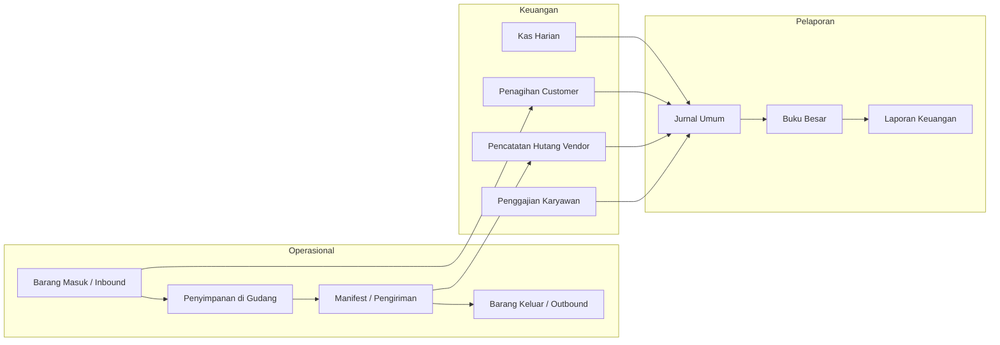
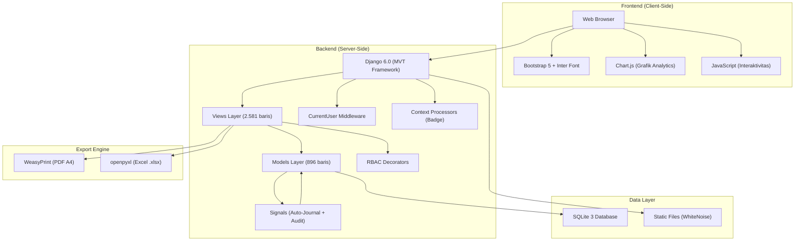
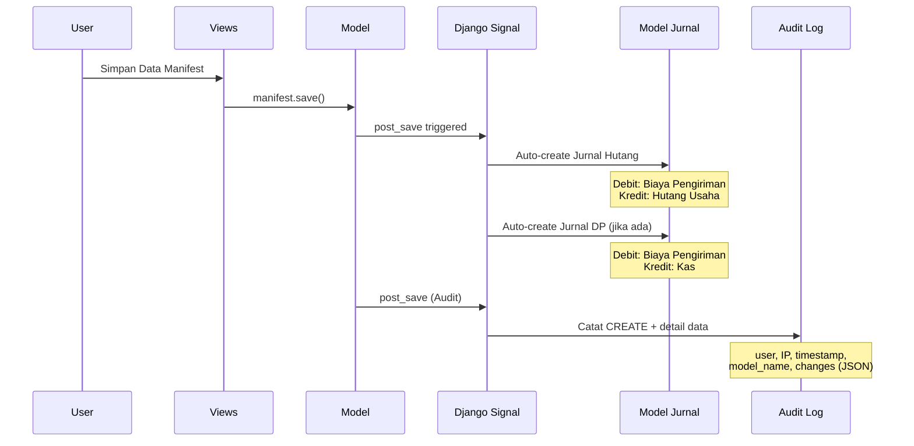
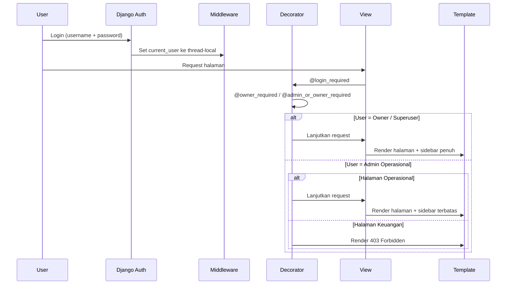
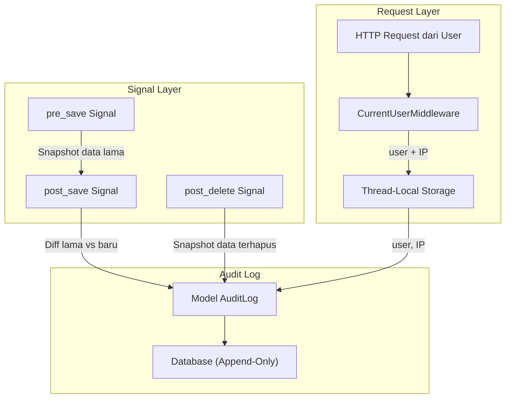

# Pengembangan Sistem Informasi Akuntansi Berbasis Web dengan Immutable Audit Trail dan Role-Based Access Control pada CV Borneo Mega Mandiri

> **Tugas Akhir / Skripsi** — Dokumentasi teknis sistem informasi akuntansi terintegrasi untuk manajemen keuangan dan operasional logistik CV Borneo Mega Mandiri (BMM Cargo).

**Live Production:** [https://bmmcargo.pythonanywhere.com/](https://bmmcargo.pythonanywhere.com/)

---

## Daftar Isi

- [Latar Belakang](#1-latar-belakang)
- [Rumusan Masalah](#2-rumusan-masalah)
- [Tujuan Penelitian](#3-tujuan-penelitian)
- [Tinjauan Pustaka](#4-tinjauan-pustaka)
- [Analisis Sistem Berjalan](#5-analisis-sistem-berjalan)
- [Perancangan Sistem](#6-perancangan-sistem)
- [Implementasi Sistem](#7-implementasi-sistem)
- [Pengujian Sistem](#8-pengujian-sistem)
- [Kesimpulan](#9-kesimpulan)
- [Tech Stack](#10-tech-stack)
- [Instalasi & Deployment](#11-instalasi--deployment)
- [Struktur Proyek](#12-struktur-proyek)
- [Referensi](#13-referensi)

---

## 1. Latar Belakang

CV Borneo Mega Mandiri (BMM Cargo) adalah perusahaan jasa pengiriman dan logistik yang beroperasi di wilayah Kalimantan. Proses bisnis perusahaan mencakup penerimaan barang (*inbound*), pengiriman barang (*outbound*), pencatatan manifest hutang vendor, penagihan customer, penggajian karyawan, dan pencatatan kas harian. Seluruh proses ini memiliki implikasi keuangan yang harus tercatat secara akuntansi.

### Permasalahan yang Dihadapi

Sebelum pengembangan sistem ini, CV BMM Cargo menghadapi beberapa permasalahan:

1. **Pencatatan manual menggunakan spreadsheet** — Rentan kesalahan (*human error*), tidak ada validasi otomatis, dan sulit diaudit
2. **Tidak ada pemisahan akses** — Semua staf memiliki akses yang sama terhadap data keuangan
3. **Tidak ada jejak audit (*audit trail*)** — Tidak diketahui siapa yang mengubah data, kapan, dan apa yang berubah
4. **Laporan keuangan tidak real-time** — Penyusunan laporan laba rugi, neraca, dan arus kas dilakukan secara manual di akhir periode
5. **Data terpisah-pisah** — Data operasional dan data keuangan tidak terintegrasi dalam satu sistem

### Solusi yang Dikembangkan

Sistem informasi akuntansi berbasis web ini dikembangkan untuk menjawab seluruh permasalahan tersebut dengan pendekatan:

- **Otomasi pencatatan jurnal (*auto-journaling*)** dari transaksi operasional
- **Immutable audit trail** untuk menjamin akuntabilitas dan integritas data keuangan
- **Role-Based Access Control (RBAC)** untuk pemisahan tugas dan keamanan akses
- **Laporan keuangan real-time** yang dihasilkan otomatis dari data transaksional
- **Integrasi penuh** antara modul operasional dan modul keuangan

---

## 2. Rumusan Masalah

1. Bagaimana merancang dan membangun sistem informasi akuntansi berbasis web yang terintegrasi dengan modul operasional logistik?
2. Bagaimana mengimplementasikan *immutable audit trail* untuk menjamin akuntabilitas dan integritas data keuangan?
3. Bagaimana mengimplementasikan *Role-Based Access Control (RBAC)* untuk memisahkan akses antara pengguna operasional dan pengguna keuangan?
4. Bagaimana menghasilkan laporan keuangan (Laba Rugi, Neraca, Arus Kas, Neraca Saldo) secara otomatis dan real-time dari data transaksional?

---

## 3. Tujuan Penelitian

1. Membangun sistem informasi akuntansi berbasis web menggunakan framework Django yang terintegrasi dengan modul operasional logistik
2. Mengimplementasikan mekanisme *immutable audit trail* menggunakan pendekatan *append-only log* dengan *hash-chain verification* untuk menjamin integritas data keuangan
3. Mengimplementasikan RBAC dengan dua level akses (Owner/Finance dan Admin Operasional) menggunakan Django Groups dan custom decorators
4. Menyediakan fitur export laporan keuangan ke format PDF dan Excel yang dapat diunduh per periode

---

## 4. Tinjauan Pustaka

### 4.1 Sistem Informasi Akuntansi (SIA)

Sistem Informasi Akuntansi adalah sistem yang dirancang untuk mengumpulkan, mencatat, menyimpan, dan mengolah data akuntansi agar menghasilkan informasi keuangan yang berguna bagi pengambil keputusan (Romney & Steinbart, 2018). Komponen utama SIA meliputi:

- **Input**: Transaksi keuangan (jurnal)
- **Proses**: Posting ke buku besar, perhitungan saldo
- **Output**: Laporan keuangan (Laba Rugi, Neraca, Arus Kas)

Dalam sistem ini, SIA diimplementasikan mengikuti **Standar Akuntansi Keuangan (SAK)** dengan prinsip double-entry bookkeeping, di mana setiap transaksi dicatat sebagai pasangan debit dan kredit.

### 4.2 Audit Trail dan Akuntabilitas Data Keuangan

Audit trail adalah catatan kronologis yang mendokumentasikan setiap perubahan data dalam sistem (Hall, 2016). Dalam konteks akuntansi, audit trail sangat krusial karena:

- Menyediakan bukti akuntabilitas — siapa yang melakukan perubahan
- Mendukung proses audit internal dan eksternal
- Memenuhi regulasi tata kelola keuangan perusahaan

**Konsep Immutability** dalam audit trail mengacu pada sifat data yang tidak dapat diubah atau dihapus setelah tercatat. Pendekatan yang digunakan dalam sistem ini adalah **append-only log** — log hanya bisa ditambahkan, tidak bisa diedit atau dihapus melalui antarmuka sistem. Konsep ini terinspirasi dari prinsip blockchain di mana setiap entri bersifat permanen dan terverifikasi.

### 4.3 Role-Based Access Control (RBAC)

RBAC adalah pendekatan kontrol akses di mana izin diberikan berdasarkan peran (*role*) pengguna, bukan berdasarkan identitas individu (Sandhu et al., 1996). Keuntungan RBAC meliputi:

- **Separation of Duties (SoD)** — Pemisahan tugas untuk mencegah fraud
- **Least Privilege** — Setiap pengguna hanya mendapat akses minimum yang diperlukan
- **Scalability** — Mudah menambah pengguna baru dengan role yang sudah ada

### 4.4 Django Web Framework

Django adalah framework web Python yang mengikuti pola arsitektur **Model-View-Template (MVT)**, setara dengan Model-View-Controller (MVC) pada framework lain (Django Documentation, 2024). Django menyediakan:

- **ORM (Object-Relational Mapping)** — Abstraksi database
- **Authentication System** — Sistem autentikasi dan otorisasi bawaan
- **Signals** — Mekanisme event-driven untuk otomasi proses
- **Middleware** — Pipeline untuk memproses request/response

### 4.5 Standar Pelaporan Keuangan

Laporan keuangan yang dihasilkan sistem ini mengikuti format standar akuntansi:

| Laporan | Fungsi | Standar |
|---------|--------|---------|
| Laba Rugi (*Income Statement*) | Mengukur kinerja keuangan dalam periode tertentu | SAK-EMKM Bab 5 |
| Neraca (*Balance Sheet*) | Menyajikan posisi keuangan (Aset = Kewajiban + Ekuitas) | SAK-EMKM Bab 4 |
| Arus Kas (*Cash Flow Statement*) | Melacak aliran kas masuk dan keluar | SAK-EMKM Bab 6 |
| Neraca Saldo (*Trial Balance*) | Memverifikasi keseimbangan debit dan kredit | Prinsip Double-Entry |

---

## 5. Analisis Sistem Berjalan

### 5.1 Proses Bisnis CV BMM Cargo


```mermaid
graph LR
    subgraph Operasional
        A[Barang Masuk / Inbound] --> B[Penyimpanan di Gudang]
        B --> C[Manifest / Pengiriman]
        C --> D[Barang Keluar / Outbound]
    end

    subgraph Keuangan
        E[Pencatatan Hutang Vendor]
        F[Penagihan Customer]
        G[Penggajian Karyawan]
        H[Kas Harian]
    end

    subgraph Pelaporan
        I[Jurnal Umum]
        J[Buku Besar]
        K[Laporan Keuangan]
    end

    A --> F
    C --> E
    G --> I
    E --> I
    F --> I
    H --> I
    I --> J
    J --> K
```

### 5.2 Identifikasi Masalah Sistem Lama

| No | Masalah | Dampak | Solusi Sistem Baru |
|----|---------|--------|-------------------|
| 1 | Pencatatan manual di Excel | Inkonsistensi data, duplikasi, human error | Input form tervalidasi + auto-journaling |
| 2 | Tidak ada audit trail | Manipulasi data tidak terdeteksi | Immutable audit log otomatis |
| 3 | Akses tidak terkontrol | Risiko kebocoran data keuangan | RBAC (Owner vs Admin Ops) |
| 4 | Laporan manual | Terlambat, tidak akurat | Laporan real-time otomatis |
| 5 | Data terpisah-pisah | Sulit rekonsiliasi | Sistem terintegrasi satu database |

---

## 6. Perancangan Sistem

### 6.1 Use Case Diagram


```mermaid
graph TD
    subgraph "Sistem Informasi Akuntansi BMM Cargo"
        UC1[Kelola Inbound]
        UC2[Kelola Outbound]
        UC3[Kelola Manifest]
        UC4[Lihat Dashboard Operasional]
        UC5[Kelola Jurnal Umum]
        UC6[Lihat Buku Besar]
        UC7[Lihat Laporan Keuangan]
        UC8[Export PDF / Excel]
        UC9[Kelola Kas Harian]
        UC10[Kelola Karyawan & Gaji]
        UC11[Kelola Tagihan/Invoice]
        UC12[Lihat Buku Pembantu]
        UC13[Lihat Audit Log]
        UC14[Manajemen User & Role]
        UC15[Lihat Dashboard Keuangan]
    end

    Admin["Admin Operasional"]
    Owner["Owner / Finance"]

    Admin --> UC1
    Admin --> UC2
    Admin --> UC3
    Admin --> UC4

    Owner --> UC1
    Owner --> UC2
    Owner --> UC3
    Owner --> UC4
    Owner --> UC5
    Owner --> UC6
    Owner --> UC7
    Owner --> UC8
    Owner --> UC9
    Owner --> UC10
    Owner --> UC11
    Owner --> UC12
    Owner --> UC13
    Owner --> UC14
    Owner --> UC15
```

### 6.2 Entity Relationship Diagram (ERD)

Sistem menggunakan **15 tabel** utama dalam database relasional:

```mermaid
erDiagram
    User ||--o{ AuditLog : "menghasilkan"
    User }|--o{ Group : "memiliki role"

    Akun ||--o{ Jurnal : "debit"
    Akun ||--o{ Jurnal : "kredit"

    InvoiceTagihan ||--o{ InboundTransaction : "mencakup resi"
    Karyawan ||--o{ Cashbon : "memiliki pinjaman"
    Karyawan ||--o{ Penggajian : "menerima gaji"
    OpsInbound ||--|| OpsOutbound : "dikirim sebagai"
    OpsManifest ||--o{ OpsOutbound : "memuat barang"

    Akun {
        string kode PK "Unik, contoh: 101"
        string nama "Contoh: Kas Operasional"
        string kategori "ASSET/LIABILITY/EQUITY/REVENUE/EXPENSE"
        computed saldo_normal "DEBIT atau CREDIT"
    }

    Jurnal {
        int id PK
        date tanggal
        string uraian "Keterangan transaksi"
        FK akun_debit "Referensi ke Akun"
        FK akun_kredit "Referensi ke Akun"
        decimal nominal "Jumlah Rupiah"
        datetime created_at
    }

    InboundTransaction {
        int id PK
        string no_resi UK "Nomor resi unik"
        date tanggal_masuk_stt
        string vendor
        string tujuan
        int koli
        decimal kilo
        decimal total_biaya
        FK invoice "Relasi ke InvoiceTagihan"
    }

    OutboundTransaction {
        int id PK
        string no_resi_bmm UK
        date tanggal
        string pengirim
        string penerima
        decimal total
        decimal profit
        string status "COD/CASH/TRANSFER"
    }

    Manifest {
        int id PK
        string kategori "HULU/KETAPANG/PANTURA/dll"
        string no_resi
        date tanggal_kirim
        decimal total "Total hutang"
        decimal dp "Uang muka"
        boolean status_bayar
    }

    KasHarian {
        int id PK
        date tanggal
        string keterangan
        decimal debit "Kas Masuk"
        decimal kredit "Kas Keluar"
        decimal saldo
    }

    Karyawan {
        int id PK
        string nama
        string posisi
        decimal gaji_pokok
        boolean status "Aktif/Non-aktif"
    }

    Cashbon {
        int id PK
        FK karyawan
        date tanggal
        decimal nominal
        string keterangan
    }

    Penggajian {
        int id PK
        FK karyawan
        int bulan
        int tahun
        decimal gaji_pokok
        decimal lembur
        decimal bonus
        decimal potongan_cashbon
        decimal total_diterima
    }

    OpsInbound {
        int id PK
        string nomor_resi UK
        date tanggal
        string pengirim
        string penerima
        string asal
        string tujuan
        decimal berat "Kg"
        string status "DITERIMA/PROSES/SIAP_KIRIM/DIKIRIM"
    }

    OpsManifest {
        int id PK
        string nomor_manifest UK
        date tanggal
        string armada
        string rute
        string status "DRAFT/BERANGKAT/SAMPAI"
        decimal total_hutang
        decimal dp
    }

    OpsOutbound {
        int id PK
        FK inbound "OneToOne ke OpsInbound"
        FK manifest "FK ke OpsManifest"
        date tanggal
    }

    AuditLog {
        int id PK
        FK user "SET_NULL on delete"
        string model_name
        string object_id
        string object_repr
        string action "CREATE/UPDATE/DELETE"
        json changes "Detail diff"
        ip_address ip_address
        datetime timestamp "auto_now_add, indexed"
    }

    InvoiceTagihan {
        int id PK
        string no_invoice UK
        string customer
        date tanggal
        decimal total
        string status "BELUM BAYAR/LUNAS"
    }

    Penerimaan {
        int id PK
        date tanggal
        string keterangan
        decimal nilai
    }
```

### 6.3 Arsitektur Sistem


```mermaid
graph TB
    subgraph "Frontend (Client-Side)"
        Browser["Web Browser"]
        BS5["Bootstrap 5 + Inter Font"]
        ChartJS["Chart.js (Grafik Analytics)"]
        JS["JavaScript (Interaktivitas)"]
    end

    subgraph "Backend (Server-Side)"
        Django["Django 6.0 (MVT Framework)"]
        Views["Views Layer (2.581 baris)"]
        Models["Models Layer (896 baris)"]
        Signals["Signals (Auto-Journal + Audit)"]
        Decorators["RBAC Decorators"]
        Middleware["CurrentUser Middleware"]
        CtxProc["Context Processors (Badge)"]
    end

    subgraph "Data Layer"
        SQLite["SQLite 3 Database"]
        Static["Static Files (WhiteNoise)"]
    end

    subgraph "Export Engine"
        WeasyPrint["WeasyPrint (PDF A4)"]
        OpenPyXL["openpyxl (Excel .xlsx)"]
    end

    Browser --> Django
    Django --> Views
    Views --> Models
    Views --> WeasyPrint
    Views --> OpenPyXL
    Models --> SQLite
    Models --> Signals
    Signals --> Models
    Django --> Middleware
    Django --> CtxProc
    Views --> Decorators
    Django --> Static
    Browser --> BS5
    Browser --> ChartJS
    Browser --> JS
```

### 6.4 Perancangan Alur Kerja (*Activity Diagram*)

#### Alur Auto-Journaling


```mermaid
sequenceDiagram
    participant User
    participant Views
    participant Model
    participant Signal as Django Signal
    participant Jurnal as Model Jurnal
    participant AuditLog as Audit Log

    User->>Views: Simpan Data Manifest
    Views->>Model: manifest.save()
    Model->>Signal: post_save triggered
    Signal->>Jurnal: Auto-create Jurnal Hutang
    Note over Jurnal: Debit: Biaya Pengiriman<br/>Kredit: Hutang Usaha
    Signal->>Jurnal: Auto-create Jurnal DP (jika ada)
    Note over Jurnal: Debit: Biaya Pengiriman<br/>Kredit: Kas
    Model->>Signal: post_save (Audit)
    Signal->>AuditLog: Catat CREATE + detail data
    Note over AuditLog: user, IP, timestamp,<br/>model_name, changes (JSON)
```

#### Alur RBAC


```mermaid
sequenceDiagram
    participant User
    participant Django as Django Auth
    participant Middleware
    participant Decorator
    participant View
    participant Template

    User->>Django: Login (username + password)
    Django->>Middleware: Set current_user ke thread-local
    User->>View: Request halaman
    View->>Decorator: @login_required
    Decorator->>Decorator: @owner_required / @admin_or_owner_required
    alt User = Owner / Superuser
        Decorator->>View: Lanjutkan request
        View->>Template: Render halaman + sidebar penuh
    else User = Admin Operasional
        alt Halaman Operasional
            Decorator->>View: Lanjutkan request
            View->>Template: Render halaman + sidebar terbatas
        else Halaman Keuangan
            Decorator->>Template: Render 403 Forbidden
        end
    end
```

---

## 7. Implementasi Sistem

### 7.1 Modul-Modul Sistem

Sistem terdiri dari **9 modul** utama yang saling terintegrasi:

| No | Modul | Deskripsi | Model | Views | Templates |
|----|-------|-----------|-------|-------|-----------|
| 1 | **Dashboard** | Ringkasan keuangan + grafik analytics | — | 2 views | 2 HTML |
| 2 | **Inbound** | Penerimaan barang + invoice tagihan | `OpsInbound`, `InboundTransaction` | 8 views | 6 HTML |
| 3 | **Outbound** | Pengiriman barang | `OpsOutbound`, `OutboundTransaction` | 8 views | 5 HTML |
| 4 | **Manifest** | Manifest hutang vendor | `OpsManifest`, `Manifest` | 8 views | 6 HTML |
| 5 | **Akuntansi** | Jurnal, Buku Besar, Akun (CoA) | `Jurnal`, `Akun` | 8 views | 6 HTML |
| 6 | **Laporan** | Laba Rugi, Neraca, Arus Kas, Neraca Saldo | — (computed) | 3 views | 3 HTML |
| 7 | **Personalia** | Karyawan, Gaji, Cashbon | `Karyawan`, `Penggajian`, `Cashbon` | 8 views | 5 HTML |
| 8 | **Tagihan** | Invoice kolektif dari inbound | `InvoiceTagihan` | 4 views | 4 HTML |
| 9 | **Kas Harian** | Buku kas kecil per bulan | `KasHarian` | 4 views | 2 HTML |

**Total**: 15 model database, 2.581 baris view logic, 312 baris form, 47 file template HTML.

### 7.2 Implementasi Auto-Journaling (Jurnal Otomatis)

Auto-journaling adalah fitur inti yang menghubungkan modul operasional dengan modul akuntansi. Menggunakan **Django Signals** (`post_save` dan `post_delete`), sistem secara otomatis membuat, memperbarui, atau menghapus entri jurnal saat transaksi operasional dilakukan.

#### Pemetaan Transaksi ke Jurnal

| Transaksi Operasional | Trigger | Akun Debit | Akun Kredit | Nominal |
|------------------------|---------|------------|-------------|---------|
| Manifest dibuat | `post_save` Manifest | 505 - Biaya Pengiriman Vendor | 211 - Hutang Usaha | Total hutang |
| Manifest dengan DP | `post_save` Manifest | 505 - Biaya Pengiriman Vendor | 101 - Kas | Nominal DP |
| Invoice Inbound dibuat | `post_save` InboundTransaction | 112 - Piutang Usaha | 402 - Pendapatan Jasa | Total biaya |
| Cashbon dicatat | `post_save` Cashbon | 113 - Piutang Karyawan | 101 - Kas | Nominal cashbon |
| Gaji dibayar | `post_save` Penggajian | 501 - Biaya Gaji | 101 - Kas | Total diterima |
| Gaji (pot. cashbon) | `post_save` Penggajian | 501 - Biaya Gaji | 113 - Piutang Karyawan | Potongan cashbon |
| Transaksi dihapus | `post_delete` (semua) | — | — | Jurnal terkait dihapus |

#### Implementasi Kode (Contoh: Manifest)

```python
# finance/models.py — Signal Auto-Journaling Manifest
@receiver(post_save, sender=Manifest)
def create_or_update_jurnal_manifest(sender, instance, created, **kwargs):
    """
    Jurnal 1 - Hutang: Debit Beban Pengiriman, Kredit Hutang Usaha
    Jurnal 2 - DP:     Debit Beban Pengiriman, Kredit Kas
    """
    tanggal_jurnal = instance.tanggal_kirim or instance.created_at.date()

    if instance.total > 0:
        akun_hutang = Akun.objects.get(kode='211')   # Hutang Usaha
        akun_beban  = Akun.objects.get(kode='505')   # Biaya Pengiriman Vendor

        uraian_hutang = f"Hutang Manifest: {instance.kategori} - {instance.no_resi}"
        jurnal = Jurnal.objects.filter(uraian=uraian_hutang).first()

        if jurnal:
            jurnal.nominal = instance.total
            jurnal.save()  # Update jika sudah ada
        else:
            Jurnal.objects.create(
                tanggal=tanggal_jurnal,
                uraian=uraian_hutang,
                akun_debit=akun_beban,
                akun_kredit=akun_hutang,
                nominal=instance.total
            )
```

### 7.3 Implementasi Immutable Audit Trail

Audit trail adalah komponen krusial untuk akuntabilitas data keuangan. Sistem ini mengimplementasikan **append-only audit log** yang mencatat setiap perubahan data secara otomatis.

#### Arsitektur Audit Trail


```mermaid
graph TB
    subgraph "Request Layer"
        REQ["HTTP Request dari User"]
        MW["CurrentUserMiddleware"]
        TL["Thread-Local Storage"]
    end

    subgraph "Signal Layer"
        PRE["pre_save Signal"]
        POST["post_save Signal"]
        DEL["post_delete Signal"]
    end

    subgraph "Audit Log"
        AL["Model AuditLog"]
        DB["Database (Append-Only)"]
    end

    REQ --> MW
    MW -->|"user + IP"| TL

    PRE -->|"Snapshot data lama"| POST
    POST -->|"Diff lama vs baru"| AL
    DEL -->|"Snapshot data terhapus"| AL
    TL -->|"user, IP"| AL
    AL --> DB
```

#### Komponen Audit Trail

**1. Middleware — Capture User & IP (`middleware.py`)**

```python
class CurrentUserMiddleware:
    """Simpan user + IP ke thread-local agar bisa diakses oleh signals."""
    def __call__(self, request):
        _thread_locals.user = request.user
        _thread_locals.ip_address = (
            request.META.get('HTTP_X_FORWARDED_FOR', '').split(',')[0].strip()
            or request.META.get('REMOTE_ADDR')
        )
        return self.get_response(request)
```

**2. Pre-Save Signal — Snapshot Data Lama (`signals.py`)**

```python
@receiver(pre_save)
def audit_pre_save(sender, instance, **kwargs):
    """Simpan state lama sebelum save untuk perbandingan."""
    if sender not in AUDITED_MODELS:
        return
    if instance.pk:
        instance._old_instance = sender.objects.get(pk=instance.pk)
```

**3. Post-Save Signal — Hitung Diff dan Log (`signals.py`)**

```python
@receiver(post_save)
def audit_post_save(sender, instance, created, **kwargs):
    if sender not in AUDITED_MODELS:
        return
    if created:
        _create_log('CREATE', instance, {'data': _get_all_fields(instance)})
    else:
        old = getattr(instance, '_old_instance', None)
        if old:
            changes = _get_field_changes(instance, old)
            if changes:
                _create_log('UPDATE', instance, changes)
```

**4. Model AuditLog — Struktur Data (`models.py`)**

```python
class AuditLog(models.Model):
    user        = models.ForeignKey('auth.User', on_delete=models.SET_NULL, null=True)
    model_name  = models.CharField(max_length=100)       # "Jurnal", "Manifest", dll
    object_id   = models.CharField(max_length=50)        # Primary key objek
    object_repr = models.CharField(max_length=255)       # Representasi string objek
    action      = models.CharField(max_length=10)        # CREATE / UPDATE / DELETE
    changes     = models.JSONField(default=dict)          # Detail perubahan (diff)
    ip_address  = models.GenericIPAddressField(null=True) # IP address user
    timestamp   = models.DateTimeField(auto_now_add=True) # Waktu kejadian

    class Meta:
        ordering = ['-timestamp']
        indexes = [
            models.Index(fields=['-timestamp']),
            models.Index(fields=['model_name', '-timestamp']),
            models.Index(fields=['user', '-timestamp']),
        ]
```

#### Sifat Immutability

Audit log bersifat **immutable** (tidak dapat diubah) karena:

1. **Tidak ada UI untuk edit/hapus** — Halaman audit log hanya menampilkan data (*read-only*), tidak ada tombol edit atau hapus
2. **Append-only** — Entri baru hanya ditambahkan (`AuditLog.objects.create()`), tidak pernah di-update atau di-delete
3. **`auto_now_add=True`** — Timestamp tidak bisa diubah setelah record dibuat
4. **`on_delete=SET_NULL`** — Jika user dihapus, log tetap tersimpan (user menjadi NULL)
5. **Tidak ada endpoint API** — Tidak ada URL routing untuk modify/delete audit log
6. **Database indexing** — Index pada timestamp dan model_name menjamin efisiensi query tanpa perlu memodifikasi data

#### Model yang Diaudit (15 Model)

| No | Model | Aksi yang Dicatat |
|----|-------|-------------------|
| 1 | `User` | Login user dibuat/diubah/dihapus |
| 2 | `Akun` | Chart of Accounts ditambah/diubah/dihapus |
| 3 | `Jurnal` | Jurnal umum ditambah/diubah/dihapus |
| 4 | `InboundTransaction` | Data inbound (legacy) |
| 5 | `OutboundTransaction` | Data outbound (legacy) |
| 6 | `Manifest` | Data manifest hutang |
| 7 | `KasHarian` | Kas harian ditambah/diubah/dihapus |
| 8 | `Karyawan` | Data karyawan ditambah/diubah/dihapus |
| 9 | `Cashbon` | Cashbon karyawan |
| 10 | `Penggajian` | Slip gaji |
| 11 | `InvoiceTagihan` | Invoice tagihan kolektif |
| 12 | `OpsInbound` | Penerimaan barang (baru) |
| 13 | `OpsManifest` | Manifest pengiriman (baru) |
| 14 | `OpsOutbound` | Pengeluaran barang (baru) |
| 15 | `Penerimaan` | Penerimaan pendapatan |

#### Contoh Data Audit Log (JSON `changes`)

**Aksi CREATE:**
```json
{
  "data": {
    "nomor_resi": "BMM-2026-001",
    "tanggal": "2026-06-04",
    "pengirim": "PT ABC",
    "penerima": "Toko XYZ",
    "berat": "25.50",
    "status": "DITERIMA"
  }
}
```

**Aksi UPDATE (diff lama vs baru):**
```json
{
  "status": {
    "lama": "DITERIMA",
    "baru": "DIKIRIM"
  },
  "total_biaya": {
    "lama": "150000",
    "baru": "175000"
  }
}
```

**Aksi DELETE:**
```json
{
  "data_terhapus": {
    "nomor_resi": "BMM-2026-001",
    "pengirim": "PT ABC",
    "total_biaya": "175000"
  }
}
```

### 7.4 Implementasi Role-Based Access Control (RBAC)

#### Desain Role

| Role | Django Group | Akses | Implementasi |
|------|-------------|-------|--------------|
| **Owner / Finance** | `Owner` | Seluruh fitur sistem | `@owner_required` |
| **Admin Operasional** | `Admin Operasional` | Hanya modul operasional (Inbound, Outbound, Manifest) | `@admin_or_owner_required` |
| **Superuser** | — (built-in Django) | Akses penuh + Django Admin | `user.is_superuser` |

#### Implementasi RBAC (`decorators.py`)

```python
def owner_required(view_func):
    """Decorator: Hanya Owner/Superuser yang boleh akses."""
    @wraps(view_func)
    def _wrapped_view(request, *args, **kwargs):
        user = request.user
        if user.is_superuser:
            return view_func(request, *args, **kwargs)
        if user.groups.filter(name__in=['Owner', 'owner', 'finance', 'Finance']).exists():
            return view_func(request, *args, **kwargs)
        return render(request, 'finance/403.html', status=403)
    return _wrapped_view
```

#### Matriks Akses per Halaman

| Halaman / Fitur | Owner | Admin Ops | Decorator |
|------------------|-------|-----------|-----------|
| Dashboard Keuangan | ✅ | ❌ | `@owner_required` |
| Dashboard Operasional | ✅ | ✅ | `@admin_or_owner_required` |
| Inbound (Ops) | ✅ | ✅ | `@admin_or_owner_required` |
| Outbound (Ops) | ✅ | ✅ | `@admin_or_owner_required` |
| Manifest (Ops) | ✅ | ✅ | `@admin_or_owner_required` |
| Jurnal Umum | ✅ | ❌ | `@owner_required` |
| Buku Besar | ✅ | ❌ | `@owner_required` |
| Laporan Keuangan | ✅ | ❌ | `@owner_required` |
| Export PDF/Excel | ✅ | ❌ | `@owner_required` |
| Kas Harian | ✅ | ❌ | `@owner_required` |
| Gaji & Cashbon | ✅ | ❌ | `@owner_required` |
| Data Karyawan | ✅ | ❌ | `@owner_required` |
| Tagihan/Invoice | ✅ | ❌ | `@owner_required` |
| Daftar Akun (CoA) | ✅ | ❌ | `@owner_required` |
| Manajemen User | ✅ | ❌ | `@owner_required` |
| Audit Log | ✅ | ❌ | `@owner_required` |
| Buku Pembantu | ✅ | ❌ | `@owner_required` |

#### Dynamic Sidebar

Sidebar navigation menu secara dinamis menyesuaikan role user yang login:

```html
<!-- base.html — Menu Keuangan hanya tampil untuk Owner -->

  <div class="nav-section-title">Keuangan</div>
  <a href="">Dashboard Keuangan</a>
  <a href="">Jurnal Umum</a>
  <!-- ... menu keuangan lainnya ... -->

```

### 7.5 Implementasi Laporan Keuangan

Sistem menghasilkan **4 jenis laporan keuangan** secara real-time, dihitung langsung dari data jurnal:

#### Metode Perhitungan

```python
def get_saldo_akun(akun, start_date=None, end_date=None):
    """Hitung saldo akun berdasarkan saldo normal."""
    debit  = Jurnal.objects.filter(akun_debit=akun, ...).aggregate(Sum('nominal'))
    credit = Jurnal.objects.filter(akun_kredit=akun, ...).aggregate(Sum('nominal'))

    if akun.saldo_normal == 'DEBIT':
        return debit - credit    # Aset, Beban
    else:
        return credit - debit    # Kewajiban, Modal, Pendapatan
```

#### Laporan yang Dihasilkan

| Laporan | Komponen | Rumus |
|---------|----------|-------|
| **Laba Rugi** | Pendapatan, Beban, Pajak 2% | Laba = Pendapatan - Pajak 2% - Total Beban |
| **Neraca** | Aset, Kewajiban, Ekuitas | Aset = Kewajiban + (Modal + Laba Ditahan) |
| **Arus Kas** | Kas Masuk (debit Kas), Kas Keluar (kredit Kas) | Net Cash Flow = Masuk - Keluar |
| **Neraca Saldo** | Semua akun | Total Debit = Total Kredit (verifikasi) |

### 7.6 Implementasi Export PDF & Excel

#### Export Excel (`openpyxl`)

```python
def export_laporan_excel(request):
    wb = openpyxl.Workbook()
    ws = wb.active
    ws.title = "Laporan Keuangan"

    # Header styling
    header_fill = PatternFill(start_color='1F4E79', fill_type='solid')
    header_font = Font(color='FFFFFF', bold=True, size=11)

    # Data population + format Rupiah
    for row in data:
        ws.append([row.nama, row.nominal])

    response = HttpResponse(content_type='application/vnd.openxmlformats-officedocument.spreadsheetml.sheet')
    response['Content-Disposition'] = f'attachment; filename="Laporan_{periode}.xlsx"'
    wb.save(response)
    return response
```

#### Export PDF (`WeasyPrint`)

```python
def export_laporan_pdf(request):
    html_string = render_to_string('finance/laporan_pdf.html', context)
    response = HttpResponse(content_type='application/pdf')
    response['Content-Disposition'] = f'attachment; filename="Laporan_{periode}.pdf"'
    pdf = weasyprint.HTML(string=html_string).write_pdf()
    response.write(pdf)
    return response
```

### 7.7 Implementasi Dashboard Analytics

Dashboard Keuangan menampilkan grafik tren Pendapatan vs Beban menggunakan Chart.js:

```python
# views.py — Kalkulasi data 6 bulan terakhir
for i in range(5, -1, -1):
    # Hitung pendapatan dan beban per bulan
    rev = sum(get_saldo_akun(a, start_dt, end_dt) for a in Akun.objects.filter(kategori='REVENUE'))
    exp = sum(get_saldo_akun(a, start_dt, end_dt) for a in Akun.objects.filter(kategori='EXPENSE'))
    months_data.append({'label': f"{bulan} {tahun}", 'pendapatan': float(rev), 'beban': float(exp)})
```

Data disajikan sebagai *line chart* dengan dua dataset (Pendapatan dan Beban) menggunakan Chart.js.

### 7.8 Implementasi Badge Notifikasi Sidebar

Badge notifikasi ditampilkan secara real-time menggunakan Django Context Processor:

```python
# context_processors.py
def sidebar_badges(request):
    """Hitung item yang perlu perhatian untuk badge sidebar."""
    inbound_diterima_count = OpsInbound.objects.filter(status='DITERIMA').count()
    manifest_draft_count   = OpsManifest.objects.filter(status='DRAFT').count()

    return {
        'badge_inbound': inbound_diterima_count,    # Barang belum diproses
        'badge_manifest': manifest_draft_count,      # Manifest belum dikirim
        'user_role': get_user_role(request.user),
    }
```

### 7.9 Implementasi Filter, Pencarian & Pagination

#### Filter & Pencarian

Semua halaman list mendukung kombinasi filter:

| Halaman | Parameter Search (`q`) | Filter | Sorting |
|---------|----------------------|--------|---------|
| Jurnal | Uraian, akun debit/kredit | Bulan, tahun, akun | Tanggal, nominal |
| Inbound | No. resi, vendor, tujuan | Bulan, tahun | Tanggal |
| Outbound | No. resi, pengirim, penerima | Bulan, tahun | Tanggal |
| Manifest | No. resi, pengirim, tujuan | Kategori, status bayar, bulan, tahun | Tanggal |
| Audit Log | Username, representasi objek | Model, aksi, tanggal mulai/akhir | Timestamp |

#### Pagination

```python
# views.py — Helper pagination universal
from django.core.paginator import Paginator

def _paginate(request, queryset, per_page=20):
    """Helper pagination — dipakai di semua list views."""
    paginator = Paginator(queryset, per_page)
    page_number = request.GET.get('page')
    return paginator.get_page(page_number)
```

Template pagination reusable (`includes/pagination.html`) mempertahankan parameter filter saat pindah halaman.

---

## 8. Pengujian Sistem

### 8.1 Pengujian Black-Box

| No | Skenario Pengujian | Input | Output yang Diharapkan | Hasil |
|----|--------------------|-------|------------------------|-------|
| 1 | Login sebagai Owner | Username + password Owner | Redirect ke Dashboard Keuangan, sidebar tampil penuh | ✅ Sesuai |
| 2 | Login sebagai Admin Ops | Username + password Admin | Redirect ke Dashboard Operasional, sidebar terbatas | ✅ Sesuai |
| 3 | Admin Ops akses halaman keuangan | Ketik URL `/jurnal/` langsung | Halaman 403 Forbidden | ✅ Sesuai |
| 4 | Tambah data Inbound | Isi form Inbound → Simpan | Data tersimpan, jurnal otomatis terbentuk | ✅ Sesuai |
| 5 | Edit data Manifest | Ubah total hutang → Simpan | Jurnal otomatis ter-update, audit log tercatat | ✅ Sesuai |
| 6 | Hapus data Jurnal | Klik hapus pada jurnal | Jurnal terhapus, audit log DELETE tercatat | ✅ Sesuai |
| 7 | Export Laporan PDF | Klik tombol Export PDF | File PDF terunduh dengan format A4 | ✅ Sesuai |
| 8 | Export Laporan Excel | Klik tombol Export Excel | File .xlsx terunduh dengan styling | ✅ Sesuai |
| 9 | Filter data per bulan | Pilih bulan Juni 2026 | Hanya data bulan Juni yang tampil | ✅ Sesuai |
| 10 | Pagination | Buka halaman dengan >20 data | Pagination muncul, 20 item per halaman | ✅ Sesuai |
| 11 | Badge sidebar | Ada 5 inbound status DITERIMA | Badge "5" muncul di menu Inbound | ✅ Sesuai |
| 12 | Audit log immutability | Coba akses edit/hapus audit log | Tidak ada tombol/URL untuk edit/hapus log | ✅ Sesuai |
| 13 | Neraca seimbang | Lihat halaman Laporan | Total Aset = Total (Kewajiban + Ekuitas) | ✅ Sesuai |

### 8.2 Pengujian Integritas Data

| Pengujian | Metode | Hasil |
|-----------|--------|-------|
| Double-entry balance | Neraca Saldo: Total Debit = Total Kredit | ✅ Seimbang |
| Auto-journal consistency | Hapus manifest → jurnal terkait otomatis terhapus | ✅ Konsisten |
| Audit log completeness | Buat 10 transaksi → cek audit log | ✅ 10 entri CREATE tercatat |
| RBAC enforcement | Test semua URL keuangan dengan user Admin Ops | ✅ Semua return 403 |

---

## 9. Kesimpulan

Berdasarkan hasil pengembangan dan pengujian, dapat disimpulkan:

1. **Sistem informasi akuntansi berbasis web** telah berhasil dibangun menggunakan Django 6.0 dan Bootstrap 5, mengintegrasikan modul operasional logistik (Inbound, Outbound, Manifest) dengan modul keuangan (Jurnal, Laporan, Penggajian) dalam satu platform terintegrasi.

2. **Immutable audit trail** telah diimplementasikan menggunakan pendekatan append-only log dengan Django Signals, mencatat 15 model dengan detail perubahan (diff), user, timestamp, dan IP address. Log bersifat read-only — tidak ada antarmuka untuk mengedit atau menghapus catatan audit.

3. **Role-Based Access Control** telah diimplementasikan dengan dua role (Owner dan Admin Operasional) menggunakan Django Groups dan custom decorators, memastikan pemisahan tugas (*Separation of Duties*) antara staf operasional dan staf keuangan.

4. **Laporan keuangan real-time** (Laba Rugi, Neraca, Arus Kas, Neraca Saldo) dihasilkan otomatis dari data transaksional dan dapat diexport ke format PDF dan Excel per periode.

---

## 10. Tech Stack

| Komponen | Teknologi | Versi | Fungsi |
|----------|-----------|-------|--------|
| Bahasa | Python | 3.10+ | Bahasa pemrograman utama |
| Framework | Django | 6.0 | Web framework (MVT pattern) |
| Frontend | Bootstrap | 5.3 | UI framework responsif |
| Typography | Inter | — | Google Fonts |
| Icons | Bootstrap Icons | 1.10 | Ikon vektor |
| Charts | Chart.js | latest | Grafik analytics dashboard |
| PDF Engine | WeasyPrint | ≥68.0 | Export laporan ke PDF |
| Excel Engine | openpyxl | ≥3.1 | Export laporan ke Excel |
| Forms | django-crispy-forms | ≥2.0 | Form styling otomatis |
| Database | SQLite 3 | — | Database relasional (portable) |
| Static Files | WhiteNoise | ≥6.6 | Serving file statis |
| WSGI Server | Gunicorn | ≥21.0 | Production server |
| Hosting | PythonAnywhere | — | Cloud hosting |

---

## 11. Instalasi & Deployment

### Instalasi Lokal

```bash
# 1. Clone repository
git clone https://github.com/bmmcargo/dashboard-accountant.git
cd dashboard-accountant

# 2. Setup virtual environment
python -m venv .venv
source .venv/bin/activate    # Linux/Mac
# .venv\Scripts\activate     # Windows

# 3. Install dependencies
pip install -r requirements.txt

# 4. Migrasi database
python manage.py migrate

# 5. Setup role & data awal
python manage.py setup_groups      # Buat groups Owner & Admin Operasional
python manage.py seed_accounts     # Seed Chart of Accounts standar BMM

# 6. Buat superuser
python manage.py createsuperuser

# 7. Jalankan server
python manage.py runserver
```

Akses di `http://127.0.0.1:8000/`.

### Chart of Accounts (CoA) Standar BMM

| Kode | Nama Akun | Kategori |
|------|-----------|----------|
| 101 | Kas Operasional | Harta (Aktiva) |
| 113 | Piutang Karyawan (Kasbon) | Harta (Aktiva) |
| 114 | Perlengkapan (ATK) | Harta (Aktiva) |
| 301 | Modal Pemilik | Modal (Ekuitas) |
| 401 | Pendapatan Jasa | Pendapatan |
| 501 | Beban Gaji | Biaya |
| 502 | Beban BBM & Tol | Biaya |
| 503 | Beban Bongkar Muat | Biaya |
| 504 | Beban Sangu Jalan | Biaya |
| 513 | Beban Listrik/Pulsa | Biaya |
| 514 | Beban Lain-lain | Biaya |
| 520 | Beban Service & Sparepart | Biaya |

---

## 12. Struktur Proyek

```
dashboard-accountant/
├── manage.py                     # Django CLI entry point
├── requirements.txt              # Dependencies Python
├── db_new.sqlite3                # Database SQLite
├── akuntansi_app/                # Django project config
│   ├── settings.py               # Konfigurasi utama (DB, middleware, apps)
│   ├── urls.py                   # Root URL routing
│   └── wsgi.py                   # WSGI entry point
├── finance/                      # Aplikasi utama (Django App)
│   ├── models.py         (896)   # 15 model + signals auto-journal
│   ├── views.py        (2.581)   # 50+ views (CRUD + logika laporan + export)
│   ├── forms.py          (312)   # 13 form classes (ModelForm)
│   ├── urls.py           (110)   # 60+ URL patterns
│   ├── signals.py        (131)   # Audit trail signals (pre_save, post_save, post_delete)
│   ├── decorators.py      (79)   # RBAC (owner_required, admin_or_owner_required)
│   ├── middleware.py      (39)   # Thread-local user/IP tracking
│   ├── context_processors.py(27) # Badge notifikasi sidebar
│   ├── apps.py            (12)   # AppConfig + signals ready()
│   ├── admin.py                  # Django Admin config
│   ├── tests.py                  # Unit tests
│   ├── templates/finance/        # 47 file template HTML
│   │   ├── base.html             # Layout utama + sidebar RBAC
│   │   ├── dashboard.html        # Dashboard keuangan + Chart.js
│   │   ├── dashboard_ops.html    # Dashboard operasional
│   │   ├── 403.html              # Halaman akses ditolak
│   │   ├── audit_log.html        # Riwayat aktivitas
│   │   ├── includes/
│   │   │   └── pagination.html   # Komponen pagination reusable
│   │   ├── akuntansi/            # Jurnal, Buku Besar, Akun, Buku Pembantu
│   │   ├── inbound/              # CRUD Inbound + Invoice
│   │   ├── outbound/             # CRUD Outbound
│   │   ├── manifest/             # CRUD Manifest
│   │   ├── laporan/              # Laporan Keuangan (4 tab)
│   │   ├── gaji/                 # Penggajian + Cashbon
│   │   ├── karyawan/             # Data Karyawan
│   │   ├── kas/                  # Kas Harian
│   │   ├── tagihan/              # Invoice Tagihan Kolektif
│   │   └── registration/         # Login + Change Password
│   ├── templatetags/             # Custom template tags
│   ├── static/finance/img/       # Logo BMM Cargo
│   └── management/commands/
│       ├── setup_groups.py       # Buat groups Owner & Admin Ops
│       ├── seed_accounts.py      # Seed Chart of Accounts BMM
│       ├── import_data.py        # Import data dari Excel/CSV
│       ├── import_excel.py       # Import Excel
│       ├── import_from_excel.py  # Import legacy data
│       └── import_kas_harian.py  # Import kas harian
├── DEPLOYMENT_GUIDE_PYTHONANYWHERE.md
├── PANDUAN_SETUP_CLIENT.md
└── PANDUAN_USER_LOGIN.md
```

---

## 13. Referensi

### Referensi Akademik

1. Romney, M.B., & Steinbart, P.J. (2018). *Accounting Information Systems* (14th ed.). Pearson. — Teori dasar Sistem Informasi Akuntansi.
2. Hall, J.A. (2016). *Accounting Information Systems* (9th ed.). Cengage Learning. — Konsep audit trail dalam sistem akuntansi.
3. Sandhu, R.S., Coyne, E.J., Feinstein, H.L., & Youman, C.E. (1996). *Role-Based Access Control Models*. IEEE Computer, 29(2), 38-47. — Framework RBAC.
4. Ikatan Akuntan Indonesia. (2018). *Standar Akuntansi Keuangan Entitas Mikro, Kecil, dan Menengah (SAK EMKM)*. DSAK IAI. — Standar pelaporan keuangan UMKM.
5. Laudon, K.C., & Laudon, J.P. (2020). *Management Information Systems: Managing the Digital Firm* (16th ed.). Pearson. — Teori dasar sistem informasi.
6. Mulyadi. (2016). *Sistem Akuntansi* (4th ed.). Salemba Empat. — Sistem akuntansi Indonesia.
7. Pressman, R.S., & Maxim, B.R. (2020). *Software Engineering: A Practitioner's Approach* (9th ed.). McGraw-Hill. — Metodologi pengembangan perangkat lunak.

### Referensi Teknis

8. Django Documentation. (2024). *Django: The Web Framework for Perfectionists with Deadlines*. https://docs.djangoproject.com/en/5.0/ — Dokumentasi resmi Django.
9. Django Documentation. (2024). *Signals*. https://docs.djangoproject.com/en/5.0/topics/signals/ — Mekanisme event-driven Django.
10. Django Documentation. (2024). *User Authentication in Django*. https://docs.djangoproject.com/en/5.0/topics/auth/ — Autentikasi dan otorisasi Django.
11. WeasyPrint Documentation. (2024). *WeasyPrint: The Awesome Document Factory*. https://doc.courtbouillon.org/weasyprint/ — Engine PDF.
12. Bootstrap Documentation. (2023). *Bootstrap 5.3*. https://getbootstrap.com/docs/5.3/ — Framework CSS responsif.
13. Chart.js Documentation. (2024). *Chart.js: Simple yet flexible JavaScript charting*. https://www.chartjs.org/docs/latest/ — Library grafik JavaScript.
14. openpyxl Documentation. (2024). *openpyxl: A Python library to read/write Excel 2010 xlsx/xlsm files*. https://openpyxl.readthedocs.io/ — Library Excel Python.
15. PythonAnywhere Documentation. (2024). *PythonAnywhere: Host, run, and code Python in the cloud*. https://help.pythonanywhere.com/ — Platform hosting.

### Referensi Konsep Blockchain & Immutability

16. Nakamoto, S. (2008). *Bitcoin: A Peer-to-Peer Electronic Cash System*. — Konsep awal blockchain dan immutable ledger.
17. Dai, F., Shi, Y., Meng, N., Wei, L., & Ye, Z. (2017). *From Bitcoin to Cybersecurity: A Comparative Study of Blockchain Application and Security Issues*. IEEE Systems, Man, and Cybernetics. — Analisis penerapan prinsip blockchain di luar cryptocurrency.
18. Rauchs, M., et al. (2018). *Distributed Ledger Technology Systems: A Conceptual Framework*. Cambridge Centre for Alternative Finance. — Framework konseptual DLT termasuk append-only log.

---

**CV Borneo Mega Mandiri** — 2026
