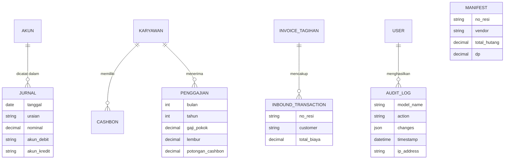
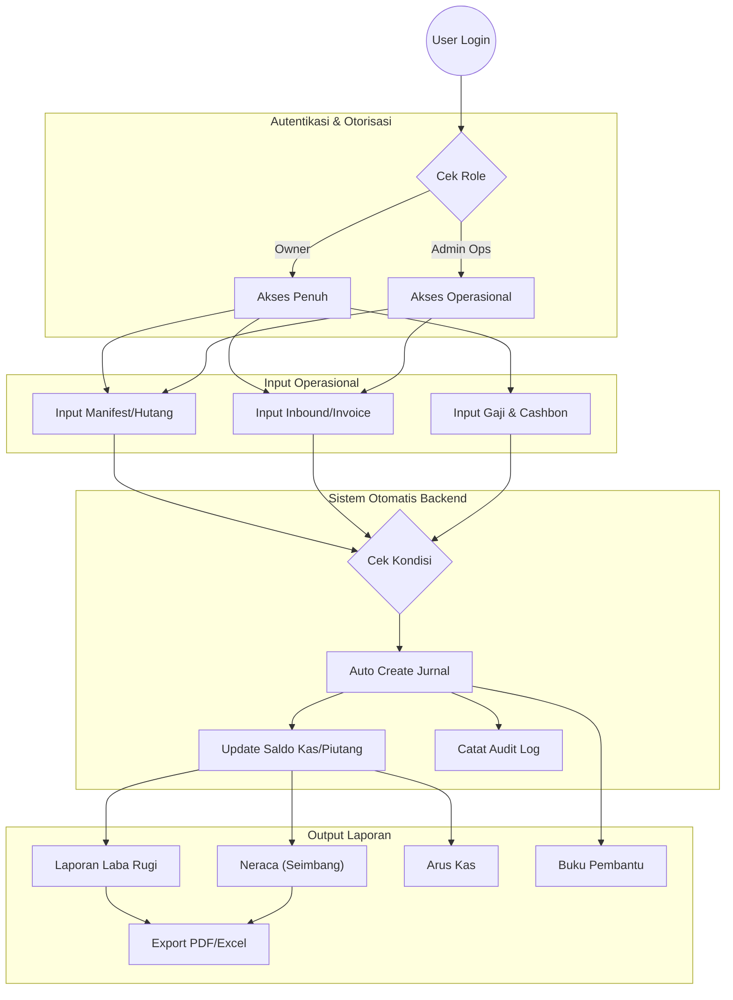

# Dashboard Keuangan & Logistik - BMM Cargo

Aplikasi web berbasis Django untuk manajemen keuangan (Akuntansi) dan operasional logistik (Inbound, Outbound, Manifest Hutang, Penggajian) yang terintegrasi penuh untuk CV Borneo Mega Mandiri.

## 🌐 Deployment

Aplikasi telah di-deploy di PythonAnywhere dan dapat diakses melalui link berikut:
🔗 **[https://bmmcargo.pythonanywhere.com/](https://bmmcargo.pythonanywhere.com/)**

Aplikasi ini menggunakan **Django 5.x/6.x** dan **Bootstrap 5** untuk antarmuka yang responsif dan modern.

---

## 🚀 Fitur Unggulan

### 1. 🤖 Sistem Akuntansi Otomatis (Auto-Journaling)

Sistem ini menghilangkan kebutuhan input jurnal manual untuk transaksi rutin. Jurnal otomatis terbentuk saat transaksi operasional dilakukan:

- **Manifest (Hutang Vendor)**:
  - Saat Manifest dibuat → Otomatis Debit `Biaya Pengiriman Vendor` & Kredit `Hutang Usaha`.
  - Jika ada DP → Otomatis Debit `Biaya Pengiriman Vendor` & Kredit `Kas`.
- **Inbound (Piutang Customer)**:
  - Saat Invoice dibuat → Otomatis Debit `Piutang Usaha` & Kredit `Pendapatan Jasa`.
- **Penggajian (Gaji & Cashbon)**:
  - Saat Slip Gaji disimpan → Otomatis Debit `Biaya Gaji` & Kredit `Kas` + `Piutang Karyawan`.
- **Cashbon**:
  - Saat input cashbon → Otomatis Debit `Piutang Karyawan` & Kredit `Kas`.

### 2. 📊 Laporan Keuangan Real-time

Laporan keuangan dihasilkan secara instan berdasarkan input data operasional:

- **Laba Rugi (Income Statement)**: Filter per periode tahun, menampilkan Pendapatan vs Beban Operasional.
- **Neraca (Balance Sheet)**: Tampilan posisi keuangan (Aset, Kewajiban, Ekuitas) yang **selalu seimbang (balance)** dengan fitur perhitungan _Laba Ditahan_ otomatis.
- **Arus Kas (Cash Flow)**: Metode langsung, melacak aliran uang masuk dan keluar.
- **Neraca Saldo**: Rekapitulasi saldo akhir semua akun.

### 3. 🚚 Manajemen Logistik & Operasional

- **Inbound (Barang Masuk)**:
  - Pencatatan resi masuk, vendor, berat (Kg), dan koli.
  - Pembuatan **Invoice Tagihan** kolektif dari beberapa resi inbound sekaligus.
  - Cetak Invoice PDF siap kirim.
- **Outbound (Barang Keluar)**:
  - Manajemen pengiriman vendor pihak ketiga.
  - Analisis Profit per resi (Selisih harga jual vs biaya vendor).
- **Manifest (Hutang Vendor)**:
  - Dashboard monitoring hutang vendor yang belum lunas.
  - Tampilan daftar manifest dengan filter "Lunas" vs "Belum".
  - Import data otomatis dari Excel/CSV.

### 4. 👥 SDM & Penggajian (Payroll)

- **Database Karyawan**: Data lengkap karyawan, jabatan, dan gaji pokok.
- **Slip Gaji Bulanan**: Form input gaji dengan perhitungan otomatis (Gaji Pokok + Lembur + Bonus - Potongan).
- **Manajemen Cashbon**: Pencatatan pinjaman karyawan dengan fitur pelunasan otomatis potong gaji.

### 5. 📒 Buku Pembantu & Kas Harian

- **Kas Harian**: Buku kas kecil opsional per bulan untuk tracking pengeluaran operasional ringan.
- **Buku Pembantu Piutang**: Rincian tagihan customer yang belum terbayar.
- **Buku Pembantu Hutang**: Rincian kewajiban ke vendor ekspedisi.

---

## 🆕 Fitur Pengembangan Terbaru (v2.0)

### 6. 📥 Export Laporan ke PDF & Excel

Laporan Keuangan kini dapat diunduh dalam format profesional:

- **Export Excel (.xlsx)**: Menggunakan `openpyxl` dengan styling header, border, dan format angka Rupiah.
- **Export PDF (.pdf)**: Menggunakan `WeasyPrint` dengan layout A4 siap cetak, termasuk Neraca Saldo dan Laba Rugi.
- **Filter Periode**: Export mendukung filter bulan/tahun — laporan hanya mencakup periode yang dipilih.

Akses: Halaman **Laporan Keuangan** → tombol dropdown **"Export"** di pojok kanan atas.

### 7. 📝 Audit Log (Riwayat Aktivitas)

Sistem audit trail otomatis untuk akuntabilitas dan keamanan data keuangan:

- **Tracking Otomatis**: Setiap aksi **Tambah**, **Ubah**, dan **Hapus** data tercatat otomatis di background.
- **14 Model Teraudit**: Mencakup Jurnal, Akun, Inbound, Outbound, Manifest, Kas Harian, Karyawan, Cashbon, Penggajian, Invoice Tagihan, OpsInbound, OpsManifest, OpsOutbound, dan Penerimaan.
- **Detail Perubahan**: Log menyimpan nilai lama vs baru (diff) untuk setiap field yang berubah.
- **Metadata Lengkap**: Mencatat user yang melakukan aksi, timestamp, IP address, dan representasi objek.
- **Filter & Pencarian**: Bisa difilter berdasarkan model, jenis aksi, tanggal, dan pencarian username/objek.

Akses: Sidebar → **Monitoring** → **Riwayat Aktivitas** _(khusus Owner)_

### 8. 🔒 Sistem 2 Akses — RBAC (Role-Based Access Control)

Pembagian akses berdasarkan peran untuk keamanan dan pemisahan tugas:

| Role | Akses Menu | Keterangan |
|------|------------|------------|
| **Owner / Finance** | Seluruh fitur | Dashboard Keuangan, Laporan, Jurnal, Tagihan, Gaji, Master Data, Manajemen User, Audit Log |
| **Admin Operasional** | Operasional saja | Dashboard Operasional, Inbound, Outbound, Manifest |

- **Proteksi View**: Decorator `@owner_required` di semua halaman keuangan — Admin Ops yang coba akses mendapat halaman **403 Forbidden**.
- **Dynamic Sidebar**: Menu sidebar otomatis menyesuaikan role user yang login.
- **Manajemen User**: Owner dapat membuat, menetapkan role, dan menghapus user melalui halaman **Manajemen User**.
- **Role Badge**: Sidebar menampilkan badge role (hijau = Owner, biru = Admin Ops) di profil user.

### 9. 🔔 Badge Notifikasi di Sidebar

Notifikasi visual real-time di sidebar untuk item yang perlu perhatian:

- **Inbound**: Badge merah menunjukkan jumlah barang berstatus **"DITERIMA"** yang belum diproses lebih lanjut.
- **Manifest**: Badge merah menunjukkan jumlah manifest berstatus **"DRAFT"** yang belum dikirim.
- Badge otomatis hilang jika tidak ada item yang tertunda.

### 10. 🔍 Filter & Pencarian Lanjutan

Semua halaman list dilengkapi dengan fitur pencarian dan filter untuk kemudahan navigasi data:

- **Inbound**: Search berdasarkan no. resi, vendor, tujuan + filter bulan/tahun.
- **Outbound**: Search berdasarkan no. resi, pengirim, penerima + filter bulan/tahun.
- **Manifest**: Search + filter kategori, status bayar (Lunas/Belum), bulan/tahun.
- **Kas Harian**: Navigasi tab per bulan dengan dropdown tahun.
- **Audit Log**: Search + filter model, aksi, rentang tanggal.

### 11. 📄 Pagination

- Helper pagination universal untuk semua halaman list.
- Default **20 item per halaman** — navigasi Previous/Next/nomor halaman di bawah tabel.
- Sudah diterapkan di halaman Audit Log, siap diterapkan di halaman lain sesuai kebutuhan.

---

## 💻 Tech Stack

Aplikasi ini dibangun menggunakan teknologi open-source yang handal dan modern:

### Backend

- **Python 3.10+**: Bahasa pemrograman utama.
- **Django 5.0+**: Framework web high-level untuk keamanan dan kecepatan pengembangan.
- **Pandas**: Library untuk pemrosesan data Excel/CSV (Import Manifest).
- **WeasyPrint**: Engine PDF untuk export laporan keuangan berkualitas cetak.
- **openpyxl**: Library untuk generate file Excel (.xlsx) dengan styling.

### Frontend

- **HTML5 & CSS3**: Struktur dan styling dasar.
- **Bootstrap 5**: Framework CSS untuk desain responsif dan komponen UI modern.
- **JavaScript (Vanilla)**: Interaktivitas sisi klien (Modal, Kalkulasi dinamis).
- **Bootstrap Icons**: Ikon vektor ringan.

### Database & Tools

- **SQLite 3**: Database default (Ringan, Portable). Kompatibel dengan PostgreSQL/MySQL untuk production.
- **Git**: Version control system.
- **Whitenoise**: Serving file statis.

---

## 🏗️ Arsitektur Sistem

### Skema Database (ERD)

Berikut adalah gambaran relasi antar entitas utama dalam sistem:


```mermaid
erDiagram
    AKUN ||--o{ JURNAL : "dicatat dalam"
    KARYAWAN ||--o{ CASHBON : "memiliki"
    KARYAWAN ||--o{ PENGGAJIAN : "menerima"
    INVOICE_TAGIHAN ||--o{ INBOUND_TRANSACTION : "mencakup"
    USER ||--o{ AUDIT_LOG : "menghasilkan"

    MANIFEST {
        string no_resi
        string vendor
        decimal total_hutang
        decimal dp
    }

    INBOUND_TRANSACTION {
        string no_resi
        string customer
        decimal total_biaya
    }

    PENGGAJIAN {
        int bulan
        int tahun
        decimal gaji_pokok
        decimal lembur
        decimal potongan_cashbon
    }

    JURNAL {
        date tanggal
        string uraian
        decimal nominal
        string akun_debit
        string akun_kredit
    }

    AUDIT_LOG {
        string model_name
        string action
        json changes
        datetime timestamp
        string ip_address
    }
```

### Alur Kerja Sistem (Flowchart)

Diagram alur bagaimana data operasional diproses menjadi laporan keuangan:


```mermaid
graph TD
    User((User Login))

    subgraph Auth ["Autentikasi & Otorisasi"]
        R{Cek Role}
        R -->|Owner| FullAccess[Akses Penuh]
        R -->|Admin Ops| LimitedAccess[Akses Operasional]
    end

    subgraph InputOps ["Input Operasional"]
        A[Input Manifest/Hutang]
        B[Input Inbound/Invoice]
        C[Input Gaji & Cashbon]
    end

    subgraph BackendSys ["Sistem Otomatis Backend"]
        D{Cek Kondisi}
        E[Auto Create Jurnal]
        F[Update Saldo Kas/Piutang]
        AL[Catat Audit Log]
    end

    subgraph OutputRep ["Output Laporan"]
        G[Laporan Laba Rugi]
        H["Neraca (Seimbang)"]
        I[Arus Kas]
        J[Buku Pembantu]
        EX[Export PDF/Excel]
    end

    User --> R
    FullAccess --> A
    FullAccess --> B
    FullAccess --> C
    LimitedAccess --> A
    LimitedAccess --> B

    A --> D
    B --> D
    C --> D

    D --> E
    E --> F
    E --> AL

    F --> G
    F --> H
    F --> I
    E --> J
    G --> EX
    H --> EX
```

---

## 🛠️ Instalasi & Pengembangan Lokal

1. **Clone Repository**

   ```bash
   git clone https://github.com/bmmcargo/dashboard-accountant.git
   cd dashboard-accountant
   ```

2. **Setup Virtual Environment**

   ```bash
   python -m venv .venv
   # Windows
   .venv\Scripts\activate
   # Linux/Mac
   source .venv/bin/activate
   ```

3. **Install Dependencies**

   ```bash
   pip install -r requirements.txt
   ```

4. **Migrasi Database**

   ```bash
   python manage.py migrate
   ```

5. **Setup Role & Akun Awal**

   ```bash
   # Buat groups (Owner & Admin Operasional)
   python manage.py setup_groups

   # Seed Chart of Accounts standar (opsional)
   python manage.py seed_accounts
   ```

6. **Buat Superuser (Admin)**

   ```bash
   python manage.py createsuperuser
   ```

7. **Jalankan Server**
   ```bash
   python manage.py runserver
   ```
   Akses di `http://127.0.0.1:8000/`.

---

## 📂 Struktur Proyek

```
finance/
├── models.py            # Model database (Akun, Jurnal, Manifest, Karyawan, AuditLog, dll)
├── views.py             # Controller utama + logika laporan & export
├── urls.py              # Routing URL
├── forms.py             # Form Django (Crispy Forms + Bootstrap 5)
├── decorators.py        # RBAC decorators (owner_required, admin_or_owner_required)
├── context_processors.py # Badge notifikasi & role user untuk sidebar
├── middleware.py        # Thread-local user/IP tracking untuk audit log
├── signals.py           # Audit trail otomatis (pre_save, post_save, post_delete)
├── apps.py              # AppConfig dengan ready() hook
├── templates/finance/
│   ├── base.html        # Layout utama + sidebar dinamis
│   ├── dashboard.html   # Dashboard keuangan
│   ├── laporan.html     # Laporan keuangan (4 tab + export)
│   ├── laporan_pdf.html # Template PDF export
│   ├── audit_log.html   # Halaman riwayat aktivitas
│   ├── 403.html         # Halaman akses ditolak
│   └── includes/
│       └── pagination.html  # Komponen pagination reusable
└── management/commands/
    ├── setup_groups.py   # Buat groups Owner & Admin Operasional
    ├── seed_accounts.py  # Seed Chart of Accounts
    └── import_excel.py   # Import data dari Excel
```

## 📝 Catatan Pengembang

- **Format Mata Uang**: Menggunakan `django-humanize` (intcomma) untuk tampilan Rupiah.
- **Timezone**: Dikonfigurasi untuk `Asia/Jakarta`.
- **Keamanan**: Seluruh manipulasi data dibatasi login (`@login_required`) + role check (`@owner_required`).
- **Audit Trail**: Setiap perubahan data tercatat otomatis — siapa, kapan, apa yang berubah.
- **PDF Engine**: Menggunakan `WeasyPrint` (kompatibel Python 3.10+).
- **Signals**: Auto-journaling ada di `models.py`, audit log ada di `signals.py` — keduanya terpisah agar maintainable.

---

**CV Borneo Mega Mandiri** — 2026
